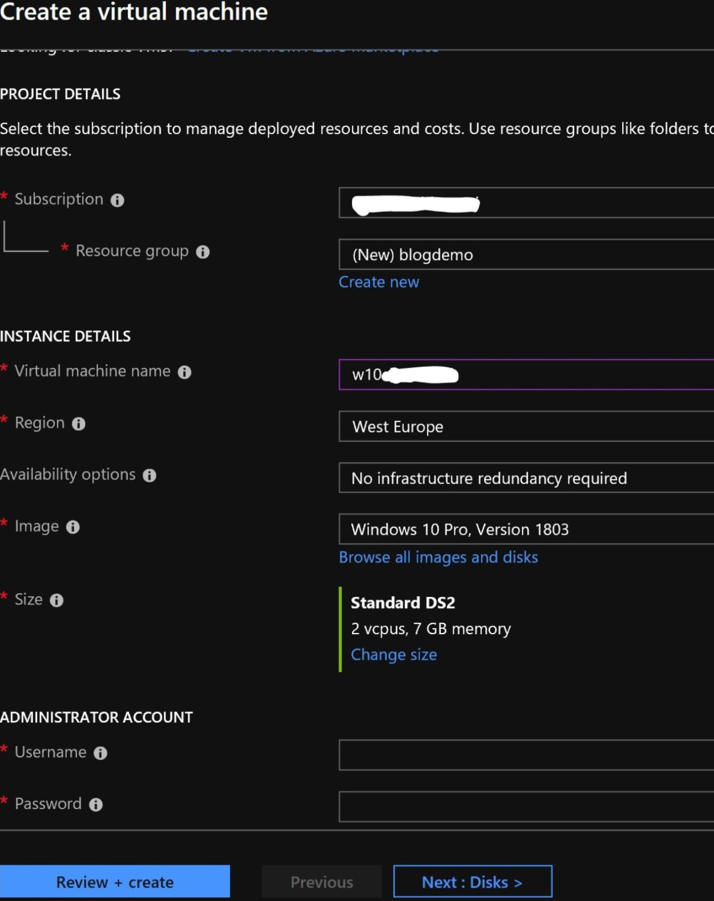
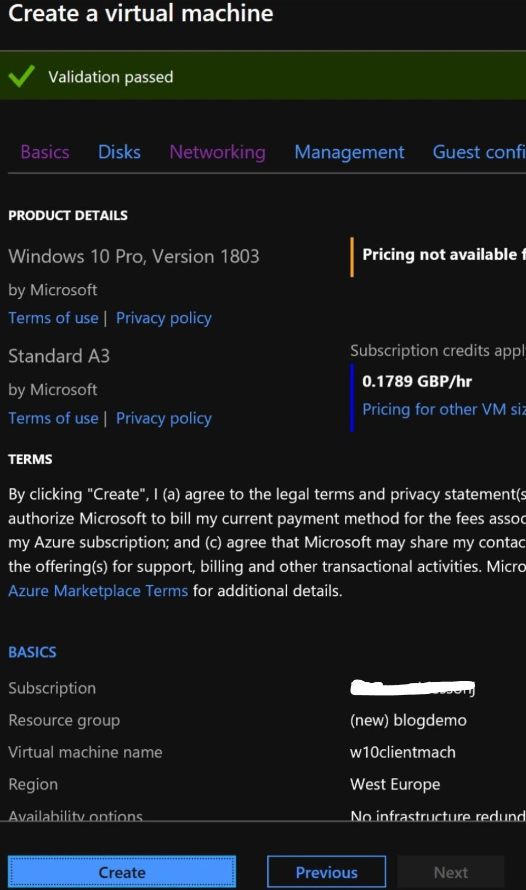
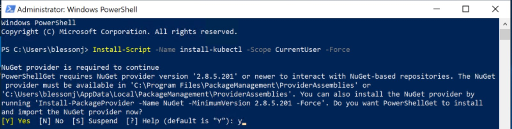
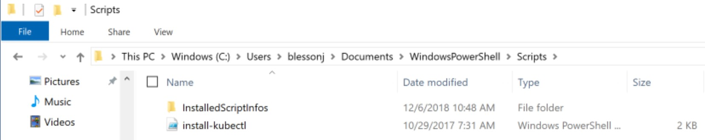
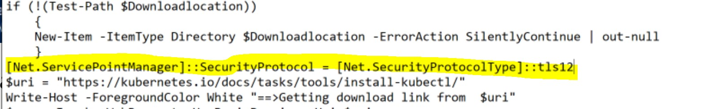
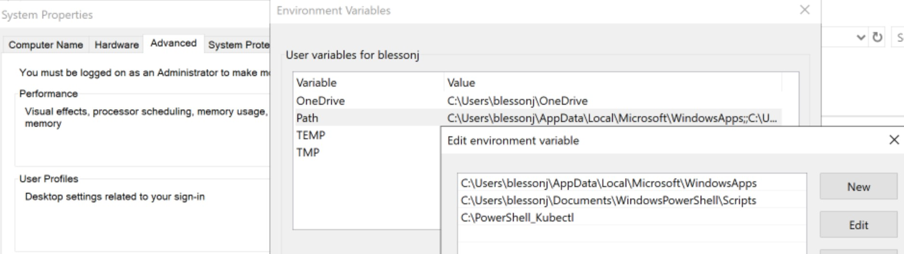
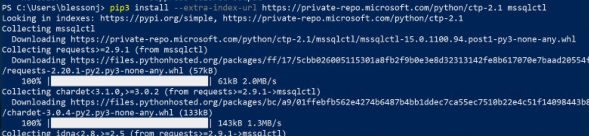

# Getting started with SQL 2019 big data cluster in Azure

## What is SQL 2019 big data cluster?

SQL Server 2019 is in preview and will include Apache spark and Hadoop Distributed File System (HDFS). 
This new architecture of SQL 2019 that combines structured and unstructured data processing engines is called a big data cluster. 
You will find more details [here](https://docs.microsoft.com/en-us/sql/big-data-cluster/big-data-cluster-overview?view=sqlallproducts-allversions).

## Sign up for SQL 2019 big data cluster

Currently, to gain access to the images that form the crux of the SQL 2019 big data cluster, the customer will need to signing up [here](https://sqlservervnexteap.azurewebsites.net/). 
Once the SQL team approves your request, you will receive a user name and password that will provide access to the containers.

## Setting up a client machine in Azure to access the big data cluster

Go to the azure portal and create a VM with Windows operating. I use a Windows 10 pro, version 1803 to build my client VM in azure.

  

You can find details about how to create a virtual machine in azure [here](https://docs.microsoft.com/en-us/azure/virtual-machines/windows/quick-create-portal). 
Once the validation is complete click on the “create” button to initiate the creation VM creation process.

  

## Install pre-requisites on the client machine (Azure VM)

To use AKS cluster, which is one of the many locations where SQL 2019 big data cluster can be installed, we will need to install [kubectl](https://kubernetes.io/docs/tasks/tools/install-kubectl/#install-kubectl) and mssqlctl CLI tool to 
manage SQL Server big data cluster. Python v3 (or greater) and pip3 are to be installed before installing mssqlctl.In addition to this, it will be good to 
install the [Azure Data Studio and SQL Server 2019 extension](https://docs.microsoft.com/en-us/sql/big-data-cluster/deploy-big-data-tools?view=sqlallproducts-allversions). 
If you intend to use Azure CLI to install AKS cluster, this will also need to be installed on the client machine that was created.

### Installing kubectl  

In the client machine open PowerShell window and paste the command

<table bgcolor="#A9A9A9">
<tr>
 <th><strong>Install-Script -Name install-kubectl -Scope CurrentUser -Force</strong></th>
</tr>
</table>

  

The script and associated artefacts are downloaded to the user’s documents folder.

  

You will need to make a small edit to the “install-kubectl.ps1” script to get it running. This is to add TLS 1.2. Add the following code just above the $uri statement.

<table bgcolor="#A9A9A9">
<tr>
 <th><strong>[Net.ServicePointManager]::SecurityProtocol = [Net.SecurityProtocolType]::tls12</strong></th>
</tr>
</table>

Your edited code will look like this

  

In PowerShell go to the directory where Install-kubectl.ps1 is present and execute the command. A download directory needs to be provided for downloading components.
You can also find the updated powershell script [here](code/install-kubectl.ps1)

<table bgcolor="#A9A9A9">
<tr>
 <th><strong>.\install-kubectl.ps1 -DownloadLocation "C:\PowerShell_Kubectl"</strong></th>
</tr>
</table>

  

Another step to do is to add the directory of kubectl into user variable <strong>path</strong>

  

If you open a new PowerShell window and execute the command kubectl --help, the command will be recognized.

### Installing mssqlctl

Install the pre-requisites for installing mssqlctl before installing mssqlctl. One will need to install python v3 or greater and pip3. 
Python can be downloaded from [here] (https://www.python.org/downloads/)

pip3 gets installed automatically if Python 2 >=2.7.9 or Python 3 >=3.4 is used.
Once installation is complete, issue the following command in a new PowerShell window.

<table bgcolor="#A9A9A9">
<tr>
 <th><strong>pip3 install --extra-index-url https://private-repo.microsoft.com/python/ctp-2.1 mssqlctl</strong></th>
</tr>
</table>

  

### Installing Azure Data Studio and SQL 2019 extension

Download Azure Data studio and use the GUI based approach to install the tool [here](https://docs.microsoft.com/en-us/sql/azure-data-studio/download?view=sqlallproducts-allversions)

The steps to download and install the SQL 2019 extension can be found [here](https://docs.microsoft.com/en-us/sql/azure-data-studio/sql-server-2019-extension?view=sqlallproducts-allversions)

### Installing Azure CLI 2.0

Optionally, if you are planning to use Azure CLI to create the AKS cluster in Azure, you will need to install Azure CLI 2.0. 
The installation steps and msi can be found [here](https://docs.microsoft.com/en-us/cli/azure/install-azure-cli-windows?view=azure-cli-latest)

#### Now, all the required components for the client machine have been installed.

## Overview of AKS cluster and SQL 2019 big data cluster

The SQL big data cluster is a cluster of Linux containers orchestrated by [Kubernetes](https://kubernetes.io/docs/concepts/). 
Kubernetes is an open source container orchestrator and helps scale according to the workload requirements.

The three important terminologies:

<table bgcolor="#A9A9A9">
<tr>
 <td>Cluster</td>
 <td>A combination of master node and worker nodes form the Kubernetes cluster. 
     The master node distributes work to the worker nodes and monitors the health of worker nodes. A cluster can have a combination of physical or virtual machines.</td>
</tr>
<tr>
 <td>Node</td>
 <td>A node could be a physical or virtual machine. A node hosts the containerized application</td>
</tr>
<tr>
 <td>Pod</td>
 <td>A pod is a logical grouping of containerized applications and associated resources. A node can host more than one pod.</td>
</tr>
</table>

Below is an example of a Kubernetes cluster

  

